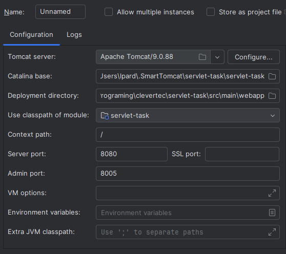

# Servlets task

## Description
An application has a login page. The correct logins are "user" with password "2222" and "admin" with password "1111". Admin can add new users.
If there are problems with deployment, you need to add jstl-1.2.jar to the apache-tomcat\lib folder
AuthFilter checks session attribute "user" for paths `/user/*`. If there isn't, it redirects the request to the `/login.jsp` page.

## Tomcat settings
